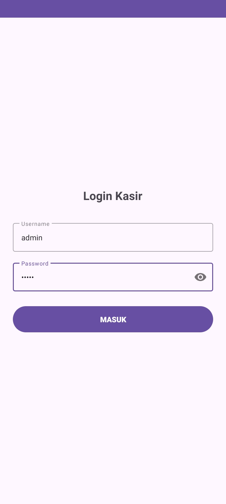
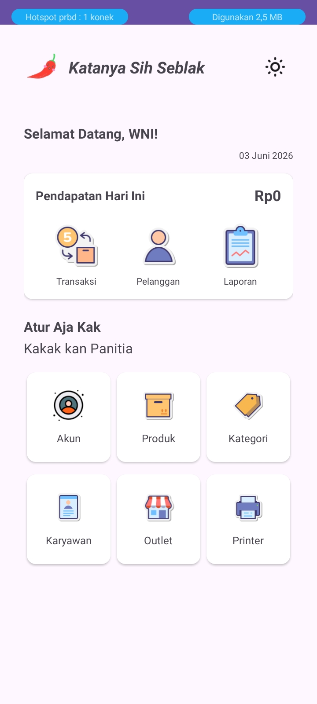
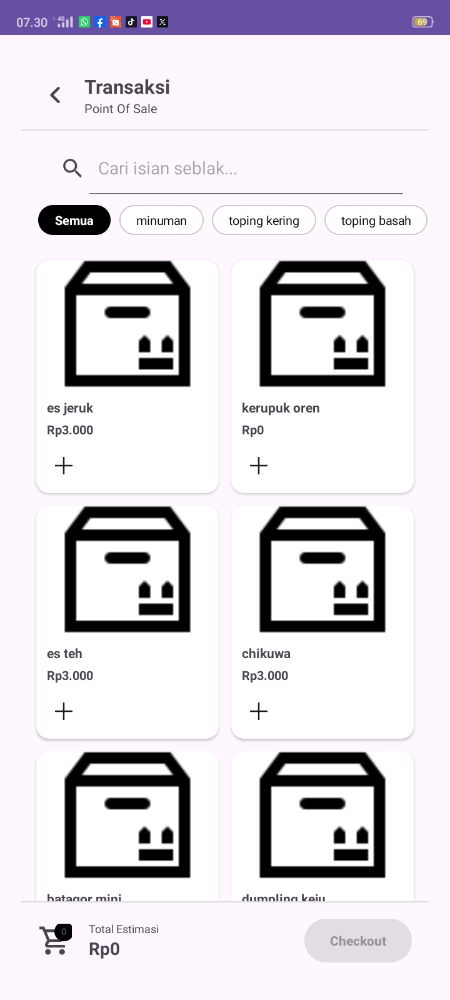
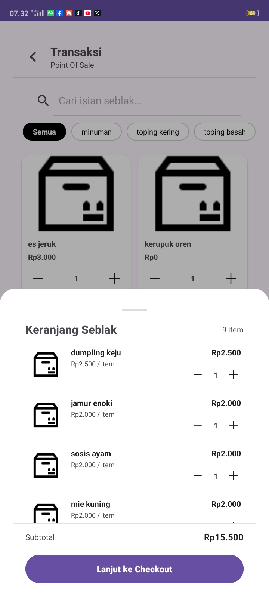
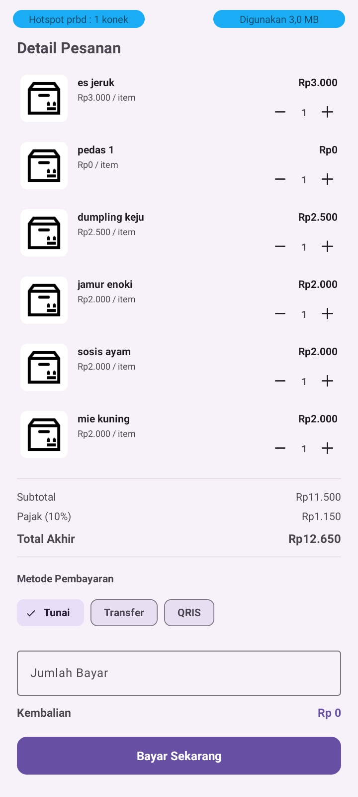
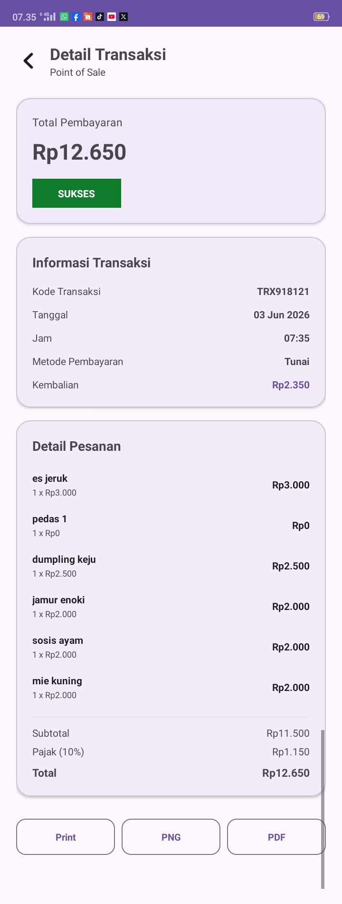
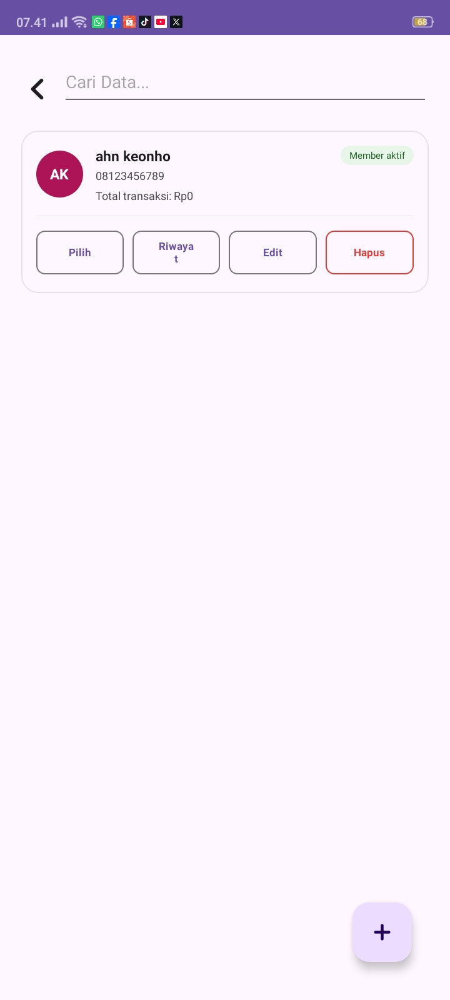

# Katanya Sih Seblak — Point of Sale App

Aplikasi kasir (Point of Sale) Android untuk usaha seblak prasmanan, dibangun dengan Kotlin + Firebase.

---

## Fitur Utama

### Transaksi
- Tampil produk aktif berdasarkan kategori aktif dari Firebase
- Filter produk per kategori (chip dinamis)
- Tambah produk ke keranjang dengan kontrol qty
- Bottomsheet keranjang — review item sebelum checkout
- Bottomsheet checkout:
  - Rincian subtotal, pajak 10%, dan total akhir
  - Pilihan metode pembayaran (Tunai / Transfer / QRIS)
  - Input jumlah bayar + kalkulasi kembalian realtime
- Transaksi tersimpan ke Firebase Realtime Database

### Detail Transaksi
- Info lengkap: kode nota, tanggal, jam, metode bayar, kembalian
- Daftar item pesanan dengan harga satuan & subtotal
- **Print struk** ke printer thermal bluetooth (ESC/POS)
- **Bagikan struk** sebagai PNG atau PDF via WhatsApp, email, dll

### Laporan
- Total omzet hari ini
- Daftar semua transaksi hari ini
- Klik transaksi → buka detail lengkap

### Pelanggan / Member
- Tambah & edit data member (nama, nomor HP)
- Avatar inisial dengan warna dinamis
- Total transaksi per member
- Hapus member dengan konfirmasi dialog
- Cari member by nama atau nomor HP

### Produk
- Tambah & edit produk
- Kalkulasi harga jual otomatis (persentase / nominal)
- Filter berdasarkan kategori & outlet
- Status aktif / non-aktif

### Kategori
- Tambah & kelola kategori produk
- Status aktif / non-aktif

### Profil & Akun
- Tampil nama, jabatan, dan username dari Firestore
- Avatar inisial dengan warna dinamis
- Logout dengan clear session

### Dark / Light Mode
- Toggle tema gelap/terang dari dashboard
- Preferensi tersimpan, konsisten di semua activity

---

## Tech Stack

| Komponen | Library / Tool |
|---|---|
| Bahasa | Kotlin |
| Database | Firebase Realtime Database |
| Auth & User | Firebase Firestore + SharedPreferences |
| UI | Material Design 3 (Material3) |
| View Binding | ViewBinding |
| Print | ESCPOS-ThermalPrinter-Android (dantsu) |
| Share | Android FileProvider (PNG & PDF) |
| Image Loading | *(opsional: Glide/Coil)* |

---

## Struktur Project

```
com.apni.pos
├── adapter/
│   ├── AdapterProdukTransaksi.kt
│   ├── AdapterKeranjang.kt
│   ├── AdapterItemDetail.kt
│   ├── PelangganAdapter.kt
│   └── RiwayatAdapter.kt
├── laporan/
│   └── LaporanActivity.kt
├── model/
│   ├── ModelTransaksi.kt
│   ├── ModelKeranjang.kt
│   ├── ModelProduk.kt
│   ├── ModelKategori.kt
│   └── ModelPelanggan.kt
├── pelanggan/
│   ├── DataPelangganActivity.kt
│   └── ModPelangganActivity.kt
├── produk/
│   ├── DataProdukActivity.kt
│   └── ModProdukActivity.kt
├── transaksi/
│   ├── TransaksiActivity.kt
│   └── DetailTransaksiActivity.kt
├── LoginActivity.kt
├── MainActivity.kt
└── ProfileActivity.kt
```

---

## Setup & Instalasi

### 1. Clone repo
```bash
git clone https://github.com/apnieee/point-of-sales.git
cd pos
```

### 2. Hubungkan Firebase
- Buat project di [Firebase Console](https://console.firebase.google.com)
- Aktifkan **Realtime Database** dan **Firestore**
- Download `google-services.json` dan taruh di folder `app/`

### 3. Struktur Firebase Realtime Database
```
├── Transaksi/
│   └── TRX000000/
│       ├── kodeTransaksi
│       ├── tanggal
│       ├── jam
│       ├── metodePembayaran
│       ├── subtotal
│       ├── pajak
│       ├── totalBayar
│       ├── jumlahUangBayar
│       ├── kembalian
│       └── listItem/
├── Produk/
├── Kategori/
├── Pelanggan/
├── Pegawai/
└── Outlet/
```

### 4. Firebase Rules (tambahkan index untuk query tanggal)
```json
{
  "rules": {
    "Transaksi": {
      ".indexOn": ["tanggal"]
    },
    ".read": true,
    ".write": true
  }
}
```

### 5. FileProvider (wajib untuk share PNG/PDF)
Pastikan `AndroidManifest.xml` ada:
```xml
<provider
    android:name="androidx.core.content.FileProvider"
    android:authorities="${applicationId}.provider"
    android:exported="false"
    android:grantUriPermissions="true">
    <meta-data
        android:name="android.support.FILE_PROVIDER_PATHS"
        android:resource="@xml/file_paths"/>
</provider>
```

Dan `res/xml/file_paths.xml`:
```xml
<?xml version="1.0" encoding="utf-8"?>
<paths>
    <cache-path name="shared_files" path="."/>
</paths>
```

### 6. Dependency penting (`build.gradle`)
```gradle
// Firebase
implementation 'com.google.firebase:firebase-database-ktx'
implementation 'com.google.firebase:firebase-firestore-ktx'

// Material Design
implementation 'com.google.android.material:material:1.x.x'

// ESC/POS Printer
implementation 'com.github.dantsu:ESCPOS-ThermalPrinter-Android:3.x.x'
```

---

## Printer Thermal Bluetooth

Aplikasi mendukung printer thermal bluetooth via library **ESCPOS-ThermalPrinter-Android** (dantsu).

- Pair printer ke HP terlebih dahulu via pengaturan Bluetooth
- Printer yang kompatibel: Xprinter, EPPOS, iDPRT, dan printer ESC/POS lainnya
- Lebar kertas: **48mm** (konfigurasi di `EscPosPrinter`)

---

## Tampilan Aplikasi

### Login


### Dashboard


### Activity Transaksi
   

### Activity Pelanggan
 

### Activity Laporan


### Activity Akun


### Activity Produk
### Activity Kategori
### Activity Karyawan
